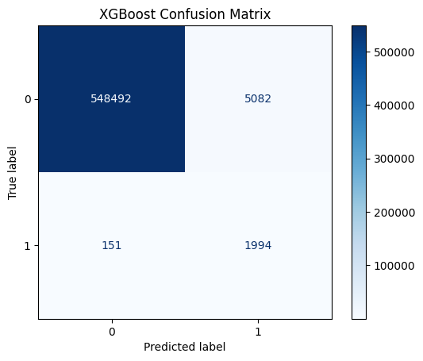
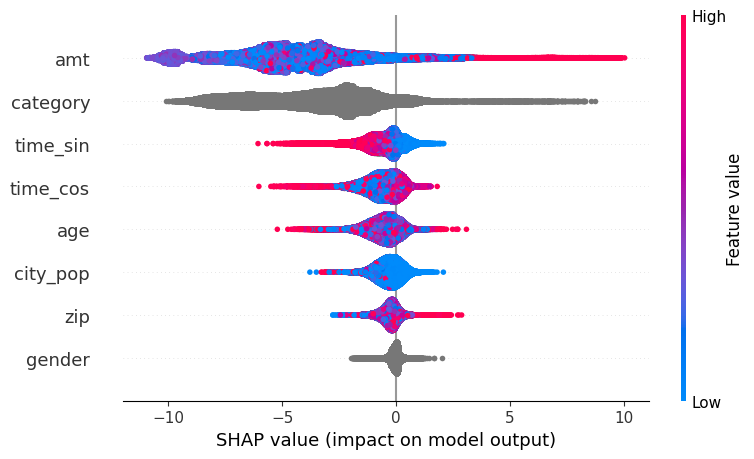

# credit fraud prediction
Working with a fraud dataset in Kaggle, I developed a model to predict credit fraud. The file `fraud_detection.ipynb` contains the main findings. Directories contain alternative data analysis techniques that did not perform as well.

Main findings used XGBoost with 2 categorical variables (transaction category and gender) and 6 numerical variables (transaction amount, time of day using sine and cosine, city population, zip code and age). Fraud cases were reweighted during training because they only make up 0.6% of all transactions.

<figure style="text-align: center;">
  
  <figcaption><em>Figure 1: Confusion matrix for our XGBoost model for predicting fraud (label = 1). Recall = 0.93, precision = 0.28. </em></figcaption>
</figure>

   

<figure style="text-align: center;">
  
  <figcaption><em>Figure 2: SHAP summary plot demonstrates that transaction amount (amt) and transaction category are the two most imporant features in our XGBoost model's performance.</em></figcaption>
</figure>

---
Acknowledgments: The computing resources for running these notebooks were provided by Google Colab.
